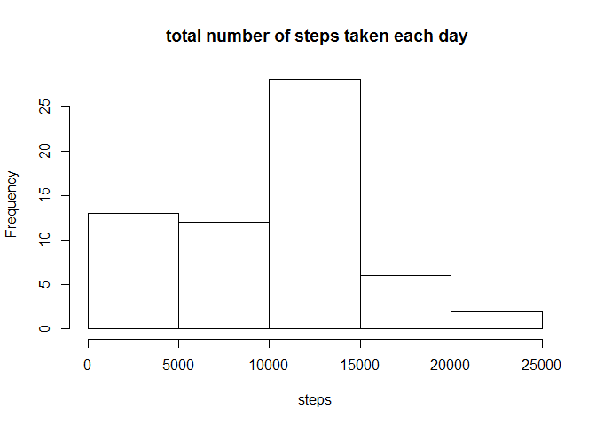
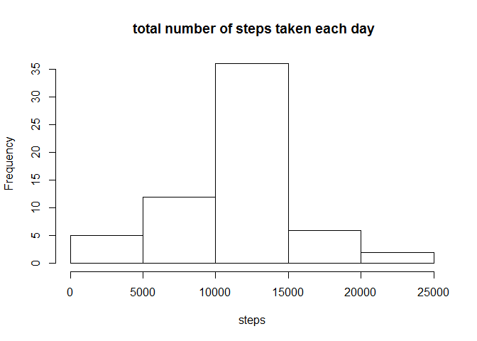
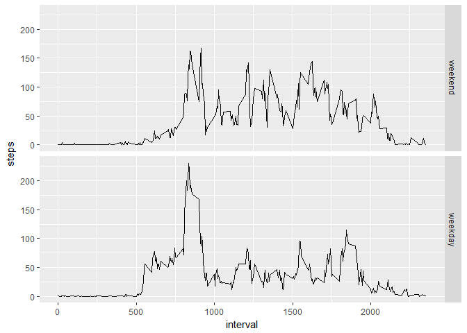

## Loading and preprocessing the data

```r
data <- read.csv("activity.csv")
data$date <- as.Date(data$date)
```

## What is mean total number of steps taken per day?

```r
library(dplyr)
```

```
## 
## Attaching package: 'dplyr'
```

```
## The following objects are masked from 'package:stats':
## 
##     filter, lag
```

```
## The following objects are masked from 'package:base':
## 
##     intersect, setdiff, setequal, union
```

```r
byDate <- group_by(data,date)
stepsPerDay <- summarise(byDate, sum(steps,na.rm=TRUE))
colnames(stepsPerDay) <- c("date", "steps")
hist(stepsPerDay$steps,
     main=" total number of steps taken each day",
     xlab="steps")
```

<!-- -->


```r
mean <- mean(stepsPerDay$steps,na.rm=TRUE)
median <- median(stepsPerDay$steps,na.rm=TRUE)
```
The mean of total number of steps taken per day is 9354.2295082.
The median of total number of steps taken per day is 10395.

## What is the average daily activity pattern?

```r
byInterval <- group_by(data,interval)
stepsPerInterval <- summarise(byInterval,mean(steps,na.rm=TRUE))
colnames(stepsPerInterval) <- c("interval","steps")
with(stepsPerInterval,plot(interval,steps,type="l"))
```

<!-- -->


```r
m <- which.max(stepsPerInterval$steps)
maxInterval <- stepsPerInterval[m,1]
```
The 5-minute interval, on average across all the days in the dataset, contains the maximum number of steps is 835.

## Imputing missing values

```r
NAs <- sum(is.na(data$steps))
```
There are 2304 missing values in the dataset. We will filling in all of the missing values in the dataset by using the mean for that 5-minute interval.

```r
data0 <- mutate(data,"fillin"=is.na(data$steps))
data0[is.na(data0)] <- 0
data1 <- merge(data0,stepsPerInterval,by="interval")
data2 <- arrange(data1,date,interval)
data3 <- mutate(data2, meansteps=fillin*steps.y+steps.x)
data4 <- select(data3,steps=meansteps,date,interval)
```

```r
byDate4 <- group_by(data4,date)
stepsPerDay4 <- summarise(byDate4, sum(steps,na.rm=TRUE))
colnames(stepsPerDay4) <- c("date", "steps")
hist(stepsPerDay4$steps,
     main=" total number of steps taken each day",
     xlab="steps")
```

<!-- -->


```r
mean4 <- mean(stepsPerDay4$steps)
median4 <- median(stepsPerDay4$steps)
```
The mean of total number of steps taken per day is 1.0766189\times 10^{4}.
The median of total number of steps taken per day is 1.0766189\times 10^{4}.

## Are there differences in activity patterns between weekdays and weekends?

```r
weekdays <- c("星期一","星期二","星期三","星期四","星期五")
data4$wDay <- factor((weekdays(data4$date) %in% weekdays), 
         levels=c(FALSE, TRUE), labels=c('weekend', 'weekday'))
```

```r
byInterval4 <- group_by(data4,interval,wDay)
stepsPerInterval4 <- summarise(byInterval4,mean(steps,na.rm=TRUE))
colnames(stepsPerInterval4) <- c("interval","wDay","steps")
library(ggplot2)
```

```
## Warning: package 'ggplot2' was built under R version 3.4.3
```

```r
qplot(interval, steps, data = stepsPerInterval4, facets = wDay ~ ., geom="line")
```

<!-- -->
